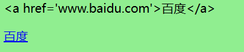
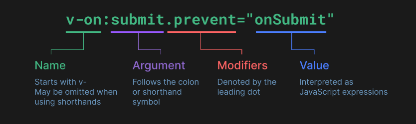

# 模板语法

模板语法是基于`HTML`的，它使我们能够声明式的将组件实例的数据绑定到 DOM 上。所有模板都是语法层面上合法的 HMML。

- 绑定对象时，会根据对象属性值的真假来切换 class

模板最终会被编译成`html`代码。结合响应式系统，当应用状态变更时，可以智能推导出渲染的最少数量，减少 DOM 操作。

## 模板和数据的动态绑定

理解模板要时刻记住，**模板在语法层面是合法的 HTML**，通过模板编译器把动态数据替换到真实的 HTML 中。这有助我们理解模板的设计。
模板中插值主要包含以下两种方式：

- 在元素的内容区域使用`{{param}}`绑定文本值，在 HTML 中整个大括号都会当成文本，模板编译器通过识别双大括号进行内容替换，这没有破坏 HTML 的规则。
- 在元素的属性上，扩展了`指令`，原生 HTML 中，属性的值是字符串（内联的事件处理程序也是字符串），模板系统引入指令结合原生的 HTML 属性，形成自定义属性。
  设计一套自定义属性解析程序就能实现对原始 HTML 属性的扩展（使其可以动态绑定数据或修改元素的行为），同时又能兼容原生的 HTML。

### 文本插值

使用的是双大括号的形式，括号中可以插入表达式，例如`<span>message: {{'hello' + message}}</span>`，表达式的值会替换整个括号。
这种方式下，表达式的值会被当成纯文本。

**注意，这种规则不适用于 HTML 属性上的绑定**

### 插入 HTML

由于`{{}}`的形式插入的是纯文本，因此如果想要插入原始的 HTML 的话，需要借助`v-html`指令。

下面展示了两种插值方式产生的不同结果


- 绑定对象时，会根据对象属性值的真假来切换 class

```html
    <*** id="app">
      <!-- 这种方式是纯文本 -->
      <p>{{message}}</p>
      <!-- 使用指令可以把文本当成html进行编译 -->
      <p v-html="message"></p>
    </**div**>

    <script type="module">
      import {
        createApp,
        ref,
      } from "https://unpkg.com/vue@3/dist/vue.esm-browser.js";

      createApp({
        setup() {
          const message = ref(`<a href='www.baidu.com'>百度</a>`);
          return { message };
        },
      }).mount("#app");
```

### HTML 属性绑定

双大括号的形式不能实现属性的绑定，属性的绑定需要使用`v-bind`指令。语法是`v-bind:[attrName]='param'`。这里使用了`[]`的方式，因为模板支持这种类似于 ES 的属性取值方式。

```html
<!-- 属性值是一个字面量对象创建表达式，第二个color是动态绑定的属性名。注意原生的属性值中不能使用{},这里因为自定义属性，所以可以使用 -->
<p v-bind:style="{color:color}">{{message}}</p>
<!-- 简写形式 -->
<p :style="{color:color}">{{message}}</p>
<!-- 这种形式叫做同名简写，类似于ES中字面量创建时属性的同名简写形式，可以省略值 -->
<p :style>{{message}}</p>
```

#### 动态绑定多个值

可能会遇到一种场景：想要把对象上所有的属性都绑定到元素上，这个时候有一种便利的语法`v-bind='attrObj'`。这种写法相当于解构 attrObj，并使用 v-bind 逐一绑定。

```html
<!-- const objectofAttrs = {id:'container',class:'wrapper'} -->
<div v-bind="objectofAttrs"></div>

<!-- 等同于下面这种写法 -->
<div v-bind:id="objectofAttrs.id" v-bind:class="objectofAttrs.class"></div>
```

#### 同名简写

因为`v-bind`非常常用，因此提供了简写形式。语法：`:[attrName]='param'`。可以省略 v-bind，直接使用冒号。
假如绑定的变量名和属性名同名，则可以采取`同名简写`形式。例如`:id`，表示把变量名为 id 的变量绑定到 id 属性上。
**同名简写需要 vue3.4+**

#### 布尔型 attribute

Boolean 类型的 attr，其值表示该属性是否应该**存在于**该元素上。最常见的就是`disabled`。`v-bind`有一个特殊的场景是属性值是空字符串，这种情况下表示`true`，其他`falsy`的值都被认为是`false`。
**在一些表单组件上使用这个属性是上述的处理方式，但是一些其他元素，表现有点不同，例如 p 元素，除了 null/undefined，都会带上这个属性及其值**

### 绑定表达式

在`{{}}`或者指令的属性值上，不仅可以使用**属性标识符**，还可以使用表达式，对表达式求值的结果会被替换到对应位置。
如果是函数调用表达式，那么该函数不应该产生副作用，例如网络请求或修改作用域外的变量，因此每次组件更新，这些表达式都会被重新求值。

- 绑定对象时，会根据对象属性值的真假来切换 class

```html
// *** number + 1; ok ? true : false; message.split("").reverse().join("");
`${message}:你好`; formateDate(data); // 语句,以下是赋值语句和流程控制语句 const
message = "zhangsan"; if (true) { // ... }
```

#### 表达式的作用域

模板中的表达式仅能访问有限的全局对象列表。

可访问的内置对象如下：

- Math
- Date
- app.config.globalProperties 上显示添加的对象。

其他的 window 上的属性都访问不了。

## 指令

指令是带有特殊前缀的 attribute，它的任务是在其表达式的值发生变化时响应式的更新 DOM。
大部分指令属性的值期望一个表达式（`v-slot`,`v-for`,`v-on`除外）。

### 指令语法



#### 参数 Arguments

跟在指令的冒号后面的字符串，就是指令参数。`v-bind:id='idStr'`，这里的`id`就是指令参数。
并不是所有的指令都需要参数。最常见的应该就是`v-bind`和`v-on`。

`v-bind`的指令参数基本都是原生的 HTML 属性名。
`v-on`的指令参数基本都是原生事件属性的一个映射(删除 on)。例如`v-on:click='count++'`

#### 动态参数

指令参数上也可以使用表达式，和属性读取一样，都是包含在`[]`内。

```html
<a v-on:[eventName]="dosomething"></a>

<a v-bind:[attrName]="dosomething"></a>
```

动态参数也有一些限制：

- 动态参数**表达式的值**应该是一个字符串或者`null`，`null`表示移除该绑定。
- 动态参数**表达式**中不能包含空格或引号，因为这在 HTML 的语法中是不合法中。
- 在使用 DOM 内嵌模板（直接在 HTML 中写模板）时，参数名称要避免出现大写，因为在 HTML 中会被强制转为小写。**在 SFC 中不受这个限制**。

#### 修饰符 Modifiers

修饰符是以点开头的特殊**后缀**，表明指令要以一些特殊的方式进行绑定。主要用在事件绑定中，简化并隔离对事件本身的操作，让事件处理程序可以专注于业务处理。
修饰符支持链式拼接，例如`v-on.stop.prevent='dosomethind'`。

### v-html

语法：`v-html='htmlStr'`

用于插入 HTML 片段。
值会替换被修饰元素的`innerHTML`。

```html
<!-- hello world字符串会被htmlStr代表的HTML片段替代 -->
<p v-html="htmlStr">hello world</p>
<p></p>
```

### v-bind

语法：

- `v-bind:id='idStr'`
- `v-bind:id='expression'`
- 简写形式：`:id='idStrOrExpression'`
- 同名简写形式：`:id`，适用于动态绑定到属性 id 上的变量名也是 id
- 动态参数形式：`:[attrName]='paramOrExpression'`，适用于需要动态参数的常见

主要用于给属性值绑定一个变量或表达式，以实现自动更新。

#### Class 和 Style 绑定

模板引擎对class和style绑定做了特殊的增强，其表达式的值支持数组和对象，详见[类和样式绑定](./模板语法/Class和Style绑定.md)


### v-on

用于事件绑定，这个事件可以是原生DOM事件，也可以是自定义事件。详见[事件处理](./模板语法/事件绑定.md)

### v-if/v-else-if/v-else/v-show

用于实现条件渲染。详见[条件渲染](./模板语法/条件渲染.md)

### v-for

可以基于一个数组或对象进行列表渲染。详见[列表渲染](./模板语法/列表渲染.md)

### v-model

用于简化表单元素的监听及处理。详见[表单输入绑定](./模板语法/表单输入绑定.md)